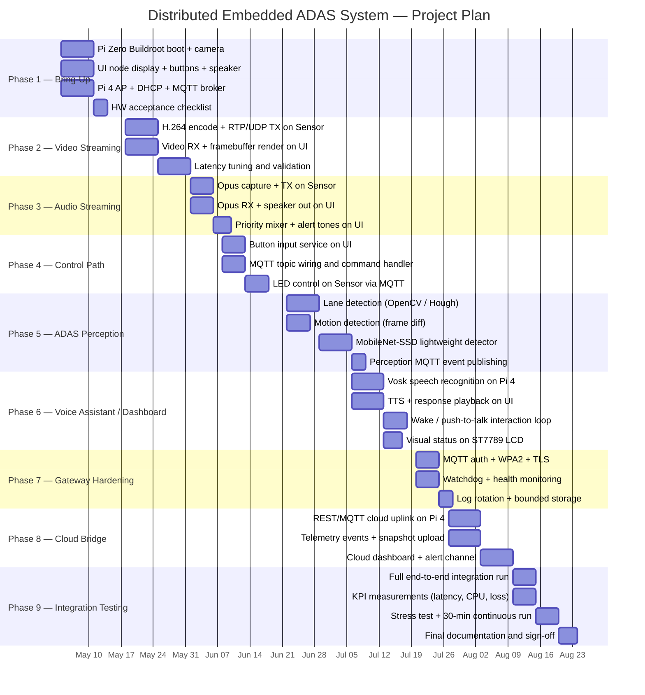

# Project Plan
## Distributed Embedded Vision + Audio ADAS System

Pi Zero W × 2 + Pi 4 × 1 — edge vision, audio, AI, and cloud gateway.

---

## Table of Contents

- [1. Project Summary](#1-project-summary)
- [2. Node Architecture Recap](#2-node-architecture-recap)
- [3. Technical Scope per Phase](#3-technical-scope-per-phase)
- [4. Dependencies and Constraints](#4-dependencies-and-constraints)
- [5. Timeline Overview](#5-timeline-overview)
- [6. Gantt Chart](#6-gantt-chart)
- [7. Milestones and Acceptance Criteria](#7-milestones-and-acceptance-criteria)
- [8. Risk Register](#8-risk-register)
- [9. Open Questions and Decisions](#9-open-questions-and-decisions)

---

## 1. Project Summary

Build a three-node embedded system combining real-time video/audio streaming, lightweight ADAS perception, an AI voice assistant dashboard, and a cloud-connected gateway — all running on constrained Raspberry Pi hardware over a private Wi-Fi fabric.

| Attribute | Value |
|-----------|-------|
| Total nodes | 3 |
| Platform | Raspberry Pi Zero W × 2, Raspberry Pi 4 × 1 |
| Primary codec | H.264 (VideoCore HW encoder) |
| Audio transport | Opus over UDP |
| Messaging | MQTT (Mosquitto on Pi 4) |
| OS (Pi Zero) | Buildroot minimal image |
| OS (Pi 4) | Raspberry Pi OS Lite / custom Linux |
| AI inference | Pi 4 only (Vosk for offline voice, MobileNet-SSD for vision) |
| Target video latency | 50–100 ms end-to-end (tuned H.264) |
| Target audio latency | 20–40 ms (Opus UDP) |
| Target duration | 16 weeks |

---

## 2. Node Architecture Recap

```text
                     +-------------------------------------+
                     |     Gateway + Master Pi 4          |
                     | AP + DHCP + MQTT + Cloud + AI/CTL  |
                     |            BrainCraft HAT           |
                     +------------------+------------------+
                                        |
                             Private 2.4 GHz WLAN
             +--------------------------+--------------------------+
             |                                                     |
+------------+------------+                           +------------+------------+
|      Sensor Pi Zero W   |                           |      UI Pi Zero W       |
|  Camera + Voice Bonnet  |                           |    Pirate Audio HAT     |
|  H.264 TX + Opus TX     |                           | Dashboard + Speaker AI  |
|  Lightweight CV/ADAS    |                           |  Voice Assistant + HMI  |
+-------------------------+                           +-------------------------+
```

### Node responsibilities

| Node | Board | HAT | CPU / RAM | Key Role |
|------|-------|-----|-----------|----------|
| Sensor | Pi Zero W v1.1 | Voice Bonnet (WM8960) | 1GHz / 512MB | Camera, mics, LEDs, lightweight CV |
| UI (Dashboard) | Pi Zero W v1.1 | Pirate Audio (ST7789 + MAX98357A) | 1GHz / 512MB | Display, speaker, voice assistant HMI, buttons |
| Gateway+Brain | Raspberry Pi 4 | BrainCraft HAT | Quad-core A72 / up to 8GB | AP, MQTT, AI, voice, cloud, orchestration |

---

## 3. Technical Scope per Phase

### Phase 1 — Hardware Bring-Up (Weeks 1–2)

Goals:
- All three nodes boot reliably from cold power-on
- Basic hardware validation on each node

Technical tasks:

**Sensor Pi Zero**
- Flash Buildroot minimal image to microSD
- Validate camera capture via CSI connector (still frame)
- Bring up Voice Bonnet I2S audio path
- Control 3× DotStar RGB LEDs via SPI/GPIO
- Confirm Wi-Fi associate to test AP

**UI Pi Zero**
- Flash Buildroot minimal image to microSD
- Bring up Pirate Audio display (ST7789 via SPI, 240×240)
- Read four tactile buttons (BCM 5/6/16/24, active low)
- Confirm speaker output on MAX98357A DAC path
- Confirm Wi-Fi associate to test AP

**Gateway + Master Pi 4**
- Flash OS image
- Bring up hostapd in AP mode on 2.4GHz channel
- Validate dnsmasq DHCP assigns leases to both Pi Zero nodes
- Bring up Mosquitto broker; confirm MQTT connect from Pi Zero nodes
- Confirm BrainCraft HAT display and mic path

Dependencies: Hardware assembled, microSD cards flashed, power supplies connected.

Acceptance:
- All nodes associate to Pi 4 AP and receive DHCP leases
- Camera frame captured on Sensor
- Speaker output confirmed on UI
- MQTT publish/subscribe works across all three nodes

---

### Phase 2 — Video Streaming (Weeks 3–4)

Goals:
- Real-time H.264 video from Sensor to UI and/or Pi 4
- Tuned for 50–100 ms end-to-end latency

Technical tasks:

**Sensor**
- Configure libcamera-vid with hardware H.264 encoder
- Set baseline profile, short GOP (10–15 frames), fixed 1.5–2 Mbps bitrate
- Stream via RTP/UDP to UI node IP

**UI**
- Implement video_receiver pipeline (GStreamer or similar)
- Set jitter buffer to 20–50 ms maximum
- Render decoded frames to framebuffer / SDL surface (no X11)

**Tuning**
- Validate end-to-end latency measurement (capture timestamp vs. display)
- Iterate GOP size and bitrate to meet 50–100 ms target
- Test with induced packet loss and confirm recovery behavior

Key parameters:
- Resolution: 640×480 primary, 320×240 fallback
- FPS: 15–25 fps when CV active; 30 fps for pure streaming
- Bitrate: 1.5–2 Mbps fixed
- Profile: baseline
- Transport: UDP/RTP (no TCP)

Dependencies: Phase 1 complete (Wi-Fi, DHCP, boot).

Acceptance:
- Stable stream at 640×480/30fps H.264 with no visible tearing
- Measured latency P95 ≤ 100 ms on local Wi-Fi

---

### Phase 3 — Audio Streaming (Week 5)

Goals:
- Opus audio streamed from Sensor to UI
- UI plays back with low latency through Pirate Audio speaker

Technical tasks:

**Sensor**
- Capture stereo audio from Voice Bonnet WM8960 via ALSA/I2S
- Encode with Opus at 48 kHz, 32–128 kbps
- Transmit over UDP

**UI (Dashboard)**
- Receive and decode Opus stream
- Output to MAX98357A DAC via I2S
- Implement priority audio mixer (P0 alerts > P1 warnings > P2/P3 media)
- Confirm push-to-talk / mute button behavior via Pirate Audio buttons

**Audio event path**
- Implement MQTT-driven audio event trigger and tone renderer on UI
- Define P0–P3 priority classes and preemption logic
- Implement fallback tone when voice pipeline is degraded

Key parameters:
- Codec: Opus 48 kHz stereo
- Bitrate: 32–128 kbps
- Transport: UDP
- Target latency: 20–40 ms

Dependencies: Phase 1 complete.

Acceptance:
- Clean stereo audio playback on UI speaker
- Alert tone preempts media audio correctly
- Measured audio latency ≤ 40 ms P95

---

### Phase 4 — Control Path (Weeks 6–7)

Goals:
- UI button events propagate to Gateway+Master via MQTT
- Gateway+Master commands LED state on Sensor

Technical tasks:

**UI**
- Implement button_input service: read BCM 5/6/16/24 with debounce
- Publish events to MQTT topic `ui/buttons`
- Handle push-to-talk event for voice assistant activation

**Gateway+Master**
- Subscribe to `ui/buttons` topic
- Implement decision stub: button → action mapping
- Publish commands to `sensor/led/set`

**Sensor**
- Subscribe to `sensor/led/set`
- Map payload to DotStar LED RGB values
- Publish `sensor/led/state` confirmation

MQTT topic namespace:

| Topic | Direction | Description |
|-------|-----------|-------------|
| `ui/buttons` | UI → Pi 4 | Button press events |
| `sensor/led/set` | Pi 4 → Sensor | LED color command |
| `sensor/led/state` | Sensor → Pi 4 | LED state confirmation |
| `audio/event/request` | Pi 4 → UI | Trigger audio alert/prompt |
| `audio/event/active` | UI → Pi 4 | Currently playing event |
| `audio/tts/request` | Pi 4 → UI | Text-to-speech content |
| `system/status` | All → Pi 4 | Heartbeat and health |

Dependencies: Phase 1 (MQTT broker up).

Acceptance:
- Button press on UI node triggers LED change on Sensor node within 100 ms
- Heartbeat topics published correctly from all nodes

---

### Phase 5 — ADAS Perception on Sensor (Weeks 8–9)

Goals:
- Lightweight CV pipeline running on Sensor alongside the H.264 stream
- Detection outputs published to Pi 4 for decision logic

Technical tasks:

**Sensor perception pipeline**
- Integrate OpenCV for frame access alongside libcamera stream
- Implement lane detection:
  - ROI crop (lower trapezoid)
  - Canny edge detection
  - Hough line transform
  - Temporal smoothing across frames
- Implement motion detection:
  - Frame differencing
  - Threshold + morphology
  - Contour area filtering
- Implement lightweight object detector (quantized MobileNet-SSD):
  - Run at 320×240 reduced resolution
  - Infer every N frames (not every frame; CPU budget constraint)
  - Output: class, confidence, bounding box

**Event publishing**
- On detection triggers: publish compact JSON to MQTT
  - `perception/lane/event`
  - `perception/motion/event`
  - `perception/objects`

**Pi 4 decision handler**
- Subscribe to perception topics
- Generate audio alert events for relevant detections
- Log detections for post-analysis

Frame budget guidance (Pi Zero W):

| Task | Approx CPU cost per frame | Recommended cadence |
|------|--------------------------|---------------------|
| H.264 encode | Low (HW) | Every frame |
| Lane detection (OpenCV) | Medium | Every frame at 15–20 fps |
| Motion detection | Low | Every frame |
| MobileNet-SSD inference | High | Every 3–5 frames |

Dependencies: Phase 2 (camera/stream pipeline stable).

Acceptance:
- Lane and motion detection running concurrently with H.264 stream at ≥15 fps
- Object detection publishing events to Pi 4 without stalling stream loop
- CPU load on Sensor node remains ≤ 80% sustained

---

### Phase 6 — AI Voice Assistant on UI Dashboard (Weeks 10–11)

Goals:
- UI node acts as in-car dashboard HMI with AI voice assistant
- Voice commands captured, processed on Pi 4, responses spoken on UI speaker

Technical tasks:

**Sensor (mic source)**
- Stream clean mic audio to Pi 4 for voice processing (dedicated Opus stream or tap)

**Pi 4 (inference)**
- Run Vosk offline speech recognition on incoming audio
- Implement intent parser (command mapping)
- Generate response content or action commands
- Publish to `audio/tts/request` and `audio/event/request`

**UI (dashboard output)**
- Receive TTS text or pre-generated audio response from Pi 4
- Run lightweight TTS renderer (espeak-ng or pre-recorded clips)
- Mix voice response into priority audio path (P2)
- Display visual status update on ST7789 LCD during interaction

**Interaction loop**
- Wake word detection or push-to-talk button trigger
- State: idle → listening → processing → responding → idle
- Safety constraint: voice response cannot play during active P0/P1 alert

Dependencies: Phase 3 (audio pipeline), Phase 4 (button events), Phase 5 (perception events).

Acceptance:
- Voice command recognized and response played on UI within 2 seconds of utterance end
- P0 alert correctly interrupts ongoing voice response
- Push-to-talk button activates listening state reliably

---

### Phase 7 — Gateway Core Hardening (Week 12)

Goals:
- Network services robust and auto-recovering
- Observability and health monitoring in place

Technical tasks:

**Pi 4 network services**
- Harden hostapd config (channel, TX power, WPA2)
- Fix DHCP leases by MAC for all nodes
- Add Mosquitto authentication (username/password)
- Enable TLS on cloud-bound MQTT uplink

**Observability**
- Publish heartbeat from all nodes to `system/status`
- Collect metrics: stream FPS, packet loss estimate, CPU/RAM, queue depths, audio underruns
- Local log rotation with bounded size on all nodes
- Watchdog restart service on each node for media and control daemons

**Security**
- WPA2 passphrase on private WLAN
- MQTT auth enforced
- Firewall: restrict inbound to required ports only
- Cloud uplink TLS only

Dependencies: Phases 1–4 complete.

Acceptance:
- All nodes reconnect automatically after simulated Wi-Fi drop
- Watchdog restarts media service within 10 seconds of crash
- MQTT auth rejects unauthenticated clients

---

### Phase 8 — Cloud Bridge and Telemetry (Weeks 13–14)

Goals:
- Pi 4 pushes telemetry, events, and snapshots to cloud backend
- Dashboard or alert mechanism for remote visibility

Technical tasks:

**Pi 4 cloud bridge**
- Implement REST or MQTT-over-TLS cloud uplink
- Publish: system status heartbeats, perception event logs, audio event logs
- Upload: periodic video snapshots (not full live stream by default)
- Implement rate limiting and retry on uplink

**Cloud backend (minimal)**
- Receive and store telemetry events
- Provide dashboard view of system health, events
- Alert channel for P0/P1 events (email / webhook)

Dependencies: Phase 7 (network hardening, TLS).

Acceptance:
- Telemetry events visible in cloud dashboard within 5 seconds of occurrence
- P0/P1 alert triggers cloud notification
- Cloud uplink failure does not affect local system behavior

---

### Phase 9 — Integration Testing and KPI Validation (Weeks 15–16)

Goals:
- Full system integration test across all phases
- KPI measurements recorded and acceptance criteria verified

Technical tasks:
- End-to-end video latency measurement (P50/P95/P99)
- End-to-end audio latency measurement
- P0 alert trigger-to-sound latency stress test
- 30-minute continuous operation test (no crashes, no dropped P0 alerts)
- Induced packet loss test (10% loss) — verify degraded-but-functional behavior
- CPU and memory profiling under full load
- Cloud uplink reliability test
- Document all KPI measurements

Acceptance criteria summary:

| KPI | Target |
|-----|--------|
| Video latency P95 | ≤ 100 ms |
| Audio latency P95 | ≤ 40 ms |
| P0 alert latency P95 | ≤ 100 ms |
| P1 alert latency P95 | ≤ 200 ms |
| Dropped P0 alerts (30 min stress) | 0 |
| Voice command response time | ≤ 2 s |
| Button-to-LED action latency | ≤ 100 ms |
| Sensor CPU under full load | ≤ 80% sustained |
| Auto-recovery after Wi-Fi drop | ≤ 10 s |
| Cloud telemetry delivery | ≤ 5 s |

---

## 4. Dependencies and Constraints

### Hard dependencies (blocking)
- Phase 2 (video) requires Phase 1 (boot + network) complete
- Phase 3 (audio) requires Phase 1 complete
- Phase 5 (ADAS CV) requires Phase 2 (camera pipeline stable)
- Phase 6 (voice AI) requires Phases 3, 4, and 5 complete
- Phase 8 (cloud) requires Phase 7 (network hardening) complete

### Hardware constraints
- Pi Zero W is single-core 1GHz with 512MB RAM — no headroom for heavy DNNs
- Pi Zero W 2.4GHz radio: safe sustained payload 6–12 Mbps
- Pi Zero W cannot run modern DNN detectors at production FPS — offload to Pi 4
- Pirate Audio amplifier peak draw: up to ~600 mA per channel; size PSU accordingly
- Pi 4 requires 5V/3A USB-C supply; do not underprovision under AI load

### Software constraints
- All timing-critical media paths in C++ (video_streamer, audio_streamer)
- Orchestration, state machines, and decision logic in Python on Pi 4
- No X11/Wayland on Pi Zero nodes — framebuffer/SDL only
- Use Buildroot for Pi Zero OS images (2–5 s boot target)
- Vosk must run offline — no cloud dependency for inference

---

## 5. Timeline Overview

| Phase | Description | Weeks | Duration |
|-------|-------------|-------|----------|
| 1 | Hardware Bring-Up | 1–2 | 2 weeks |
| 2 | Video Streaming | 3–4 | 2 weeks |
| 3 | Audio Streaming | 5 | 1 week |
| 4 | Control Path (MQTT + LEDs + Buttons) | 6–7 | 2 weeks |
| 5 | ADAS Perception on Sensor | 8–9 | 2 weeks |
| 6 | AI Voice Assistant on UI Dashboard | 10–11 | 2 weeks |
| 7 | Gateway Hardening + Observability | 12 | 1 week |
| 8 | Cloud Bridge + Telemetry | 13–14 | 2 weeks |
| 9 | Integration Testing + KPI Validation | 15–16 | 2 weeks |

Total: **16 weeks**

---

## 6. Gantt Chart



---

## 7. Milestones and Acceptance Criteria

| Milestone | Phase | Target Week | Gate Criteria |
|-----------|-------|-------------|---------------|
| M1: Hardware validated | 1 | Week 2 | All nodes boot, associate, MQTT connects |
| M2: Video stream live | 2 | Week 4 | 640×480 H.264 stream, ≤100 ms P95 latency |
| M3: Audio stream live | 3 | Week 5 | Clean Opus playback, ≤40 ms P95 latency |
| M4: Control path live | 4 | Week 7 | Button → LED action ≤100 ms round trip |
| M5: ADAS perception live | 5 | Week 9 | Lane + motion + objects running, CPU ≤80% |
| M6: Voice assistant live | 6 | Week 11 | Voice command → spoken response ≤2 s |
| M7: Gateway hardened | 7 | Week 12 | Auth enforced, watchdog active, auto-recovery ≤10 s |
| M8: Cloud bridge live | 8 | Week 14 | Telemetry in cloud dashboard, alert delivery confirmed |
| M9: Full integration pass | 9 | Week 16 | All KPIs met, 30-min stress test clean |

---

## 8. Risk Register

| Risk | Likelihood | Impact | Mitigation |
|------|-----------|--------|------------|
| Pi Zero CPU overrun under combined CV + encode load | High | High | Run inference at reduced cadence (every N frames); drop to 320×240 for CV path |
| Wi-Fi 2.4GHz congestion or interference | Medium | High | Fix AP channel, reduce bitrate, implement frame-skip under load |
| Buildroot build complexity and driver issues | Medium | Medium | Start from known working BSP; validate each HAT driver independently |
| MobileNet-SSD too slow on Pi Zero | High | Medium | Offload to Pi 4 if latency exceeds budget; Pi Zero publishes raw frames via side channel |
| Opus codec integration issues on Buildroot | Low | Medium | Pre-validate Opus encode/decode on hardware before Buildroot integration |
| MQTT broker instability under load | Low | High | Use Mosquitto with bounded persistence; monitor queue depth; add reconnect logic |
| Cloud uplink instability affecting local system | Low | High | Local system must be fully autonomous; cloud uplink failure must not degrade local behavior |
| Voice recognition accuracy on Vosk | Medium | Low | Use push-to-talk as primary trigger; wake word as optional enhancement |
| P0 audio alert latency exceeds 100 ms target | Medium | High | Local tone generator on UI node; P0 path must not traverse full MQTT round trip |

---

## 9. Open Questions and Decisions

| Item | Status | Notes |
|------|--------|-------|
| Pi 4 RAM variant | Open | Choose based on AI workload; 4GB recommended minimum for Vosk + detection |
| Buildroot vs Pi OS on Pi 4 | Decided | Pi OS Lite on Pi 4; Buildroot on Pi Zero nodes |
| Wake word engine | Open | Porcupine (offline) or push-to-talk only |
| Cloud backend target | Open | AWS IoT / MQTT, Azure IoT Hub, or self-hosted; TLS MQTT bridge either way |
| Microphone for voice (UI vs Sensor) | Open | Sensor has Voice Bonnet stereo mics; UI has no onboard mic — voice capture stays on Sensor |
| MobileNet-SSD inference node | Decided | Pi 4 Brain for heavy inference; Pi Zero runs lane/motion only by default |
| Video snapshot format for cloud | Open | JPEG at reduced resolution; frequency TBD per cloud cost budget |

---

## 10. Cloud Node Addendum (Logging, OTA, Telemetry)

This addendum introduces an explicit Cloud Node control plane integrated through the Gateway + Master Pi 4.

### Scope
- Telemetry ingestion and KPI storage
- Centralized structured logging
- OTA campaign orchestration with canary rollout and rollback

### Phase 8 Expansion
- Add Cloud Node services for log indexing and telemetry dashboarding
- Add OTA manifest service, rollout scheduler, and rollback controller
- Validate end-to-end OTA canary flow before fleet-wide rollout

### Additional Acceptance Gates
- Telemetry + logs searchable by node_id within 5 seconds of publish
- OTA canary update and automatic rollback both pass validation
- Cloud outage does not impact local ADAS alerting and control loop
